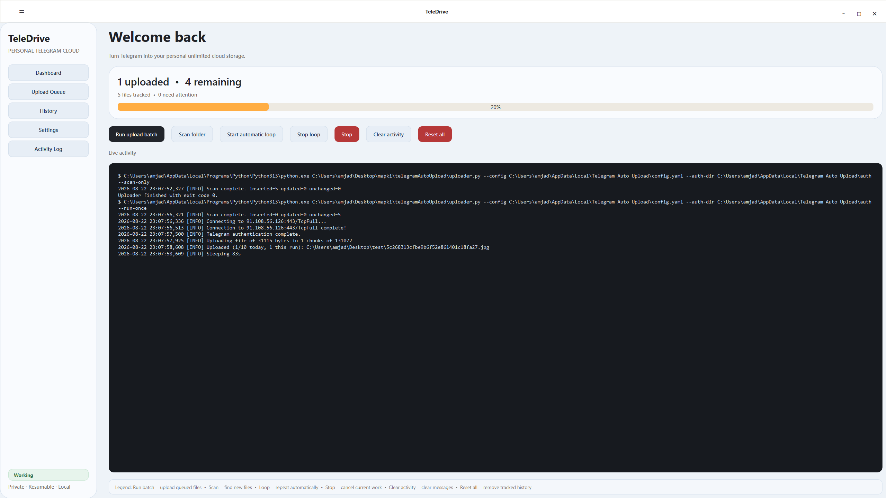
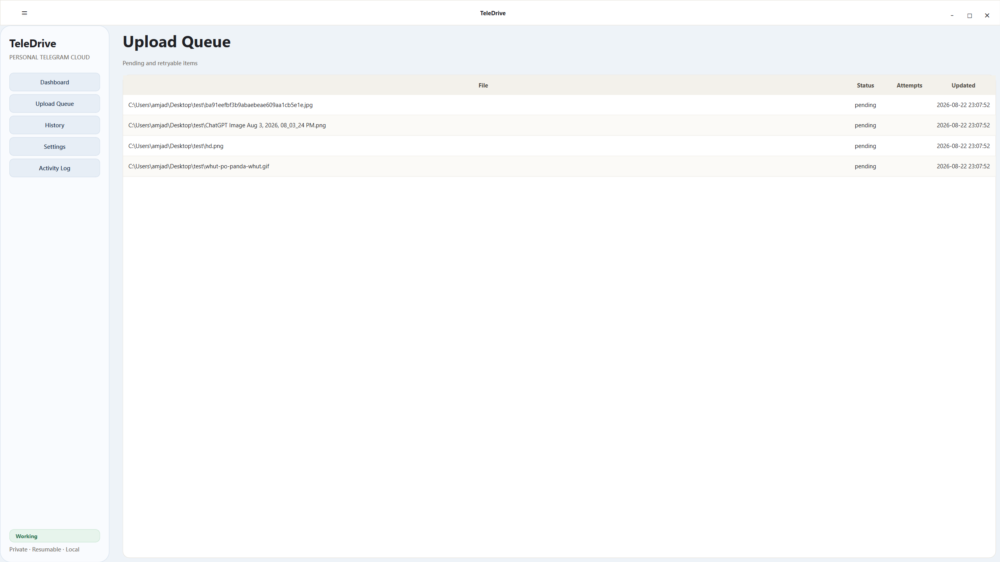
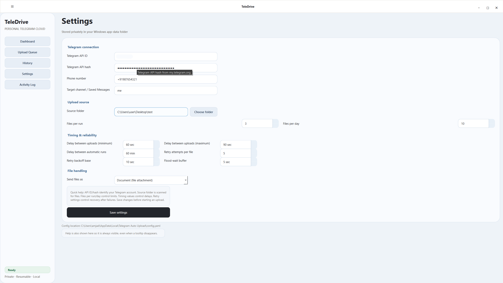

# Telegram Auto Upload

Safe, slow, resumable Telegram file uploader for Windows and Linux.

TeleDrive turns Telegram into a personal cloud uploader. It scans a local folder,
queues files in SQLite, and uploads them gradually with retry and flood-wait handling.

## Desktop application

The production UI is a PySide6 desktop app. It stores configuration, the Telegram
session, logs, and SQLite state under:

```text
Windows: `%LOCALAPPDATA%\Telegram Auto Upload`  
Linux: `~/.local/share/Telegram Auto Upload`
```

Run from source:

```powershell
python -m pip install -r requirements.txt
python -m app.main
```

## Screenshots

### Dashboard



### Upload queue



### Settings



## Build on Windows

Create the portable Windows application folder:

```powershell
.\build.ps1
```

Output: `dist\TeleDrive.exe`

This is a standalone executable. You can copy only this `.exe` to another Windows
machine; no Python installation is required.

To create the installer, install Inno Setup 6 and run:

```powershell
.\build-installer.ps1
```

The installer is per-user and does not require administrator privileges.

The installer output is `dist-installer\TeleDrive-Setup-1.0.0.exe`.

### Quick install on Windows

Open Command Prompt and paste:

```bat
mkdir "%TEMP%\TeleDrive" 2>nul & curl.exe -fL --progress-bar -o "%TEMP%\TeleDrive\TeleDrive-Setup-1.0.0.exe" "https://github.com/amjadlle/TeleDrive/releases/download/v1.0.0/TeleDrive-Setup-1.0.0.exe" & if errorlevel 1 (echo Download failed. & exit /b 1) else if not exist "%TEMP%\TeleDrive\TeleDrive-Setup-1.0.0.exe" (echo Installer was not downloaded. & exit /b 1) else (powershell -NoProfile -Command "Unblock-File -LiteralPath $env:TEMP\TeleDrive\TeleDrive-Setup-1.0.0.exe; Start-Process -FilePath $env:TEMP\TeleDrive\TeleDrive-Setup-1.0.0.exe" & echo TeleDrive setup launched.)
```

This downloads the Windows installer with visible progress and opens the setup
wizard.

### Quick install on Linux

Open a terminal and paste:

```bash
curl -fL --progress-bar -o /tmp/TeleDrive-linux-x86_64.tar.gz \
  "https://github.com/amjadlle/TeleDrive/releases/download/v1.0.0/TeleDrive-linux-x86_64.tar.gz" && \
mkdir -p "$HOME/TeleDrive" && \
tar -xzf /tmp/TeleDrive-linux-x86_64.tar.gz -C "$HOME/TeleDrive" && \
"$HOME/TeleDrive/TeleDrive/TeleDrive"
```

This downloads the Linux package, extracts it to `~/TeleDrive`, and launches
TeleDrive.

These commands are platform-specific: Windows uses the `.exe` installer, while
Linux uses the `.tar.gz` archive.

## Build on Linux

The same source code runs on Linux with Python, PySide6, Telethon, and PyYAML:

```bash
python3 -m venv .venv
source .venv/bin/activate
python -m pip install -r requirements.txt
python -m app.main
```

Create a Linux executable folder with PyInstaller:

```bash
python -m pip install pyinstaller
python -m PyInstaller --noconfirm --clean --windowed \
  --name "Telegram Auto Upload" --hidden-import uploader desktop.py
```

The Linux output is created under `dist/Telegram Auto Upload/`. The Windows `.exe`
and Inno Setup installer are Windows-specific; they are not used on Linux.

The repository also includes `build-linux.sh`, which automates the Linux build and
creates `dist-installer/TeleDrive-linux-x86_64.tar.gz`:

```bash
bash build-linux.sh
```

After extracting the archive, launch the app with:

```bash
./TeleDrive/TeleDrive
```

To package the Linux build for sharing:

```bash
tar -czf TeleDrive-linux-x86_64.tar.gz -C dist "Telegram Auto Upload"
```

Linux users need to build on Linux (or inside WSL); PyInstaller does not cross-compile
a Linux executable from Windows.

## First use

1. Launch the desktop application.
2. Open Settings.
3. Enter the Telegram API ID and API hash from `my.telegram.org`.
4. Set the target to `me` for a safe Saved Messages test.
5. Choose a small source folder.
6. Save settings and scan the folder.
7. Run one upload batch.

## Recommended settings

For a steady, conservative personal backup, start with:

| Setting | Recommended value | Meaning |
| --- | ---: | --- |
| Files per run | `20` | Maximum files uploaded in one batch. |
| Files per day | `500` | Daily upload cap across all batches. |
| Delay between uploads (minimum) | `20 sec` | Shortest wait after a successful upload. |
| Delay between uploads (maximum) | `60 sec` | Longest wait after a successful upload; TeleDrive chooses a random wait in this range. |
| Delay between automatic runs | `60 min` | Wait between batches when automatic loop mode is enabled. |
| Retry attempts per file | `3` | Total attempts for a file after temporary errors, including the first attempt. |
| Retry backoff base | `30 sec` | Starting retry delay; later retries increase to 60, 120 seconds, and so on. |
| Flood-wait buffer | `30 sec` | Extra time added when Telegram tells TeleDrive to wait. |
| Send files as | `Document` | Keeps files as file attachments rather than converting media. |

These values are a conservative starting point for a private personal archive. Telegram
limits are dynamic, so no configuration can guarantee that an account will never receive
a flood wait or other restriction. If Telegram reports a `FLOOD_WAIT`, let TeleDrive
finish the server-requested wait instead of restarting repeatedly or running multiple
copies of the app.

### How the timing settings work

- **Delay between uploads:** After each successful file, TeleDrive waits a random time
  between the minimum and maximum values before continuing.
- **Delay between automatic runs:** A batch starts immediately when the loop is enabled;
  this value controls the wait before the next batch begins.
- **Retry attempts per file:** Temporary network or Telegram errors trigger retries. A
  file is not uploaded repeatedly when it succeeds.
- **Retry backoff base:** Failed retries wait progressively longer: with a 30-second base,
  the delays are 30, 60, and 120 seconds.
- **Flood-wait buffer:** If Telegram returns `FLOOD_WAIT_60` and the buffer is 30 seconds,
  TeleDrive waits 90 seconds before continuing.

For the safest operation, upload only to your own private channel or Saved Messages,
keep one TeleDrive process running, and avoid using the same account for bulk messaging
while a backup is active.

The first login requests the Telegram code and, if enabled, the two-step verification
password. The session is stored locally and reused on later runs.

## Backend CLI

The uploader engine remains available for automation and diagnostics:

```powershell
python uploader.py --config path\to\config.yaml --scan-only
python uploader.py --config path\to\config.yaml --run-once
```

## Safety behavior

- Recursive source-folder scanning
- SQLite queue with resumable state
- One file uploaded at a time
- Configurable delays and daily/run limits
- Retry and flood-wait handling
- Changed or missing files are skipped safely
- Single-process lock prevents overlapping runs

Keep the target private while testing, avoid modifying files during an active upload,
and back up the local state database and Telegram session when migrating machines.

## License

This project is licensed under the MIT License. See [LICENSE](LICENSE).

## Contributing

Bug reports, documentation improvements, and code contributions are welcome. Please
read [CONTRIBUTING.md](CONTRIBUTING.md) before opening a pull request.
